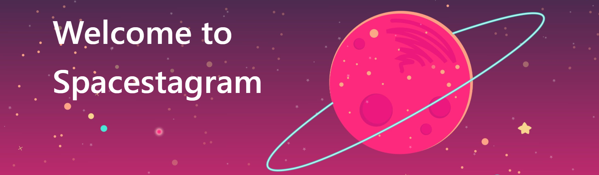

# Spacestagram | [Live Demo](https://spacestagram-hazel.vercel.app/) | 🚀

<div align="text-align:center">
  
</div>
Presenting **Spacestagram**, *Enjoy the Universe at your fingertips*.

- The live version of this app can be found [here](https://spacestagram-hazel.vercel.app/)
- [Challenge specification](https://docs.google.com/document/d/1QlC6htA5SXEl3YruAOkJWj2-0W3w-n0UOzGuJ1EcktQ/edit)

## 🔍 Preview

### 📱 Mobile


### 💻 Desktop


## 📚 Table of Contents

- [🔍 Preview](#-preview)
  - [📱 Mobile](#-mobile)
  - [💻 Desktop](#-desktop)
- [📚 Table of Contents](#-table-of-contents)
- [👏 Features](#-features)
- [⌨ Running Locally](#-running-locally)
  - [Setting up NASA credentials](#setting-up-nasa-credentials)
  - [Build for Production](#build-for-production)
- [👩‍💻 Technologies and Libraries Used](#-technologies-and-libraries-used)
- [📋 Description](#-description)
- [❓ Questions](#-questions)
- [🌎 Special Thanks](#special-thanks) 

## 👏 Features

  * 📅 Explore the space from a specified date
  * 🔀 Explore the space at random moments
  * ❤️ Explore your own favourite cards
  * 🔃 Loading state when waiting for NASA's API to return data
  * 👍 Persits likes and loves of cards
  * 👀 Click on eye icon to view details
  * ♾ Infinite scroll
  * 🔥 Special Animation all over the place
  * 📁 Copy Media URL to Clipboard

## ⌨ Running Locally

Firstly, you need clone this repository and install dependencies by using the command line:

```bash
git clone https://github.com/phucthang1101/Spacestagram app
cd app
npm install
```

### Setting up NASA credentials

Secondly, to access this website, you have to create an API key in order to use NASA's API call. Follow the steps below to create one:

1. Visit https://api.nasa.gov
2. Enter basic details which are asked (like name, email) and the API key will be generated

### Run Development Environment
Lastly, You will need a **"next.config.js"** file in the root directory to run successfully. An example for the next.config.js file has been written in exampleConfig.js. Modify the NASA API key value as you need and required before starting. 

After all that, let's give it a try by typing:
```bash
npm run dev
```


## 👩‍💻 Technologies and Libraries Used

- ReactJs
- NextJs
- TypeScript
- Material UI
- Redux
- [NASA's APOD API](https://github.com/nasa/apod-api)


## 📋 Description
This project was built by me within 1 week as I found out about the technical challenge for the Shopify Frontend Developer Internship pretty late. Project goals included using technologies learned up until this point and familiarizing myself with ways to implement new features.
I built Spacestagram using NextJs and Typescript to allow for rapid development, easy implementation of the various dynamic features and make sure to increase SEO performance.
At all points of development the application was tested on different devices to allow for a seamless experience. Generic components from Material UI were used for responsive while specific interface elements such as cards and all animations were coded from scratch.


## ❓ Questions

If you have any problems or questions, you can email me at matttran1101@gmail.com or contact me on my website: https://matthewtrn.me/


## 🌎 Special Thanks

1. [Shopify](https://www.shopify.ca/) for the wonderful challange that allow my creativity running freely on their interesting idea,
2. [NASA](https://www.nasa.gov/) for their fascinating API,
3. [FontAwesome](https://fontawesome.com/) for the other svg icons
4. [Lighthouse](https://developers.google.com/web/tools/lighthouse/) for their accessibility auditing
